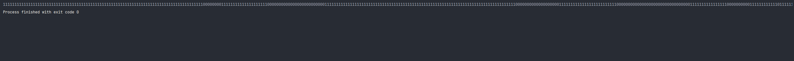

# JavaStudy
interface vs abstract class


### 추상클래스란?
- 추상클래스는 일반 클래스와 크게 다를 것이 없습니다. 단지 추상메서드를 선언하여 상속을 통해서 자손 클래스에서 완성되도록 유도하는 클래스입니다. 그래서 미완성 설계도라고 합니다. 상속을 위한 클래스이기 때문에 따로 객체를 생성할 수 없습니다.
- class 앞에 "abstract" 예약어를 사용하여 상속을 통해 구현해야한다는 것을 알려주고 선언부만 작성하는 추상메서드를 선언할 수 있습니다.
  - abstract class 클래스이름 {
    ...
    public abstract void 메서드이름();
    }
### 인터페이스란?
- 추상클래스가 미완성 설계도라면 인터페이스는 기본설계도 라고 할 수 있습니다. 인터페이스도 추상클래스처럼 다른 클래스를 작성하는데 도움을 주는 목적으로 사용하고 클래스와 다르게 다중상속(구현)이 가능합니다.
    interface 인터페이스이름 {
    public static final 상수이름 = 값;
    public abstract void 메서드이름();
}
 

### 인터페이스 추상클래스 차이점?
 - 추상클래스와 인터페이스의 공통점은 추상메서드를 사용할 수 있다는 것 입니다. 그럼 왜 굳이 2가지로 나눠서 사용할까?
   - 추상클래스가 인터페이스의 역할을 다 할 수있는데 왜 굳이 인터페이스가 있을까?
     - 가장큰 차이점은 사용용도라고 생각합니다.
 

 

1. 사용도의 차이점

추상클래스는 IS - A "~이다".
인터페이스는 HAS - A "~을 할 수 있는".
이렇게 구분하는 이유는 다중상속의 가능 여부에 따라 용도를 정한 것 같습니다. 자바의 특성상 한개의 클래스만 상속이 가능하여 해당 클래스의 구분을 추상클래스 상속을 통해 해결하고, 할 수 있는 기능들을 인터페이스로 구현합니다.

이렇게 글로 표현하여 이해가 어려울 수 있습니다. 아래 예제를 통해 더 자세하게 설명하겠습니다.(코드 참조)

 

2. 공통된 기능 사용 여부
만약 모든 클래스가 인터페이스를 사용해서 기본 틀을 구성한다면... 공통으로 필요한 기능들도 모든 클래스에서 오버라이딩 하여 재정의 해야하는 번거로움이 있습니다. 이렇게 공통된 기능이 필요하다면 추상클래스를 이용해서 일반 메서드를 작성하여 자식 클래스에서 사용할 수 있도록 하면 된다. 어!? 그러면 그냥 추상클래스만 사용하면 되는 거 아닌가요? 위에서 얘기 했듯이 자바는 하나의 클래스만 상속이 가능합니다. 만약 각각 다른 추상클래스를 상속하는데 공통된 기능이 필요하다면? 해당 기능을 인터페이스로 작성해서 구현하는게 편하겠죠?

 

추상클래스 인터페이스 예제 (생명체)


위와 같은 관계를 갖는 예제를 만들어 보겠습니다. 인간과 동물은 생명체를 상속하고 각 생명체들은 구분에 따라 인간과 동물을 상속합니다. 그리고 각각 할 수 있는 기능들을 인터페이스로 구현했습니다.


기본적으로 생명체가 갖는 요소로 위치 x, y그리고 age 나이가 필요하다고 생각하여 선언했고 생성자가 만들어 질때 이 3가지 요소는 받아서 넣을 수 있도록 했습니다. toString 메서드는 나중에 출력은 간편하게 하기 위해서 오버라이딩하여 사용했습니다.


생명체라면 나이를 먹고 x좌표상으로 이동 할 수 있는 부분이 공통 적인 기능이기 때문에 하위 클래스에서 상속할 수 있도록 일반 메서드로 구현했습니다.


추상메서드로는 공격하는 기능과 정보를 출력하는 기능을 선언했습니다. 모든 생명체에 필요한 기능이지만 각각 생명체에 따라 다른 기능으로 구현을 해야하기 때문에 위 두 메서드는 추상메서드로 선언하여 하위클래스에서 처리하도록 한 것입니다.

### Animal 추상클래스

 동물 클래서는 생명체이기 때문에  Creature 추상클래스를 상속했습니다. 동물은 몸을 사용하여 공경하기 때문에 추상메서드 중에 attack메서드를 오버라이딩 하였습니다.
 
### Human 추상클래스

인간 클래스도 마찬가지로 attack 추상메서드는 구현해주고, printInfo 추상메서드는 아래로 위임한 것입니다. 인간 클래스는 동물 클래스와 다르게 Talkable 인터페이스를 구현했습니다.


### Pigeon 일반클래스

비둘기 클래스는 일반 클래스입니다. 동물 클래스를 상속하고 날수 있는 동물이기에 Flyable 인터페이스를 구현해주고 해당 메서드들을 구현 해 주었습니다.

### Fly 인터페이스


- 정리
추상클래스 사용 시기 : 상속 관계를 쭉 타고 올라갔을때 같은 조상클래스를 상속하는데 기능까지 완변히 똑같은 기능이 필요한 경우

(ex. attack, printInfo)

- 인터페이스 사용 시기 : 상속 관계를 쭉 타고 올라갔을때 다른 조상클래스를 상속하는데 같은 기능이 필요할 경우 인터페이스 사용

(ex. Swimable)


# JVM

### JVM 메모리구조  ( 예제는 코드참조 )

응용프로그램이 실행되면 ,JVM은 시스템으로부터 프로그램을 수행하는데 필요한 메모리를 할당받고 JVM은 이 메모리를 용도에 따라 여러 영역으로 나누어 관리한다. 그 중 3가지 주요 영역(method area, call stack, heap)에 해 알아보자


1. 메서드 영역(method area)
  - 프로그램 실행 중 어떤 클래스가 사용되면, JVM은 해당 클래스의 클래스파일(*.class)을 읽어서 분석하여 클래스에 대한 정보(클래스 데이터)를 이곳에 저장한다. 이 때, 그 클래스의 클래스변수(class variable)도 이영역에 함께 생성된다.

2. 힙 영역(heap)
  - 인스턴스가 생성되는 공간, 프로그램 실행 중 생성되는 인스턴스는 모두 이곳에 생성된다. 즉, 인스턴스변수(instance variable)들이 생성되는 공간이다.

3. 호출스택(call stack 또는 execution stack)
  - 호출스택은 메서드의 작업에 필요한 메모리 공간을 제공한다. 메서드가 호출되면, 호출스택에 호출된 메서드를 위한 메모리가 할당되며, 이 메모리는 메서드가 작업을 수행하는 동안 지역변수(매개변수 포함)들과 연산의 중간결과 등을 저장하는데 사용한다. 그리고 메서드가 작업을 마치게되면 할당되었던 메모리공간은 반환되어 비워진다.

메서드를 위한 메모리상의 작업공간은 서로 구별되며, 첫 번째로 호출된 메서드를 위한 작업공간이 호출스택의 맨 밑에 마련되고, 첫 번째 메서드 수행중에 다른 메서드를 호출하면, 첫 번째 메서드의 바로 위에 두 번재로 호출된 메서드를 위한 공간이 마련된다.
Stack 구조를 생각하자. 맨위의 작업이 끝나면 아래순서로 작업을 처리한다.


# 기본형 매개변수와 참조형 매개변수 ( 예제는 코드참조 )
자바에서메서드를 호출할 때 매개변수로 지정한 값을 메서드의 매개변수에 복사해서 넘겨준다. 매개변수의 타입이 기본형(primitive type)일 때는 기본형 값이 복사되겠지만, 참조형(Reference type)이면 인스턴스의 주소가 복사된다. 메서드의 매개변수를 기본형으로 선언하면 단순히 저장된 값만 얻지만, 참조형으로 선언하면 값이 저장된 곳의 주소를 알 수 있기 때문에 값을 읽어 오는 것은 물론 값을 변경하는것도 가능하다.

> **기본형 매개변수** 변수의 값을 읽기만 할 수 있다.(read only) <br />
> **참조형 매개변수** 변수의 값을 읽고 변경 할 수 있다.(read& write)

*** 

# 프로세스 vs 스레드
> 프로세스는 간단히 말해서 현재 '실행 중인 프로그램'이다.  프로그램을 실행하면 OS로부터 실행에 필요한 자원(메모리)를 할당받아 프로세스가 된다.
프로세스는 프로그램을 수행하는 데 필요한 데이터와 메모리 등의 자원 그리고 쓰레드로 구성되어 있으며 프로세스의 자원을 이용해서 실제로 작업을 수 행하는 것이 바로 쓰레드다.
모든 프로세스는 최소 하나 이상의 스레드가 존재하며, 둘 이상의 쓰레드를 가진 프로세스를 '멀티쓰레드 프로세스' 라고 한다.'

> 프로세스 : 쓰레드 = 공장 : 일꾼 </br>
> 싱글 쓰레드 프로세스 = 자원 + 스레드 </br>
> 멀티 쓰레드 프로세스 = 자원 + 스레드 + 스레드 + 스레드 ...++ </br>


 
### 멀티 태스킹과 멀티 스레딩 
현재 우리가 사용하고 있는 윈도우나 유닉스를 포함한 대부분의 os는 멀티태스킹(다중 작업)을 지원하기 대문에 여러 개의 프로세스가 동시에 실행될 수 있다.
이처럼 멀티쓰레딩은 하나의 프로세스 내에서 여러 쓰레드가 동시에 작업을 수행하는 것이다. CPU 코어가 한 번에 하나의 작업만 수행할 수 있으므로, 실제로 동시에 처리되는 작업의 개수는 코어의 개수와 일치한다.
하지만, 스레드의 수는 코어의 개수보다 훨씬 많기 때문에 각 코어가 아주 짧은 시간 동안 여러 작업을 번갈아 가며 수행함으로써 여러 작업들이 모두 동시에 수행되는 것처럼 보이게된다.

###  멀티 스레딩의 장 단점 
도스(dos)와 같이 한 번에 한 가지 작업만 할 수 있는 OS와 윈도우와 같은 멀티태스킹이 가능한 OS의 차이는 이미 경험으로 잘 알 고 있을 것이다.

>  멀티 스레드의 장점  </br>
 - CPU의 사용률을 향상시킨다.
 - 자원을 보다 효율적으로 사용할 수 있다.
 - 사용자에 대한 응답성이 향상된다.
   - 예를들어 채팅프로그램에서 이미지 업로드를했는데 업로드가 다될때까지 기다리지 않고 그사이에 채팅도 할수있는것을 상상해보자. (이것이 멀티 스레드) 응답성 향상.
 - 작업이 분리되어 코드가 간결해진다.
 
예를들어 메신저로 채팅하면서 파일을 다운로드 받거나 음성대화를 나눌 수 있는 것이 가능한 이유가 바로 멀티쓰레드로 작성되어 있기 때문이다. 만일 싱글쓰레드로 작성되어 있다면 파일을 다우놀드 받느 동안에는 다른 일을 전혀 할 수 없다.

>  멀티 스레드의 단점  </br>
멀티쓰레드는 프로세스에있는 스택영역을 제외한 모든 영역을 공유하면서 사용하기 때문에 동기화(synchroization), 교착상태(deadlock)과 같은 문제들을 고려해서 사용해야한다.

- 동기화(synchronization) 에 주의해야한다.
- 교착상태(dead-lock): 두 쓰레드가 자원을 점유한 상태에서 서로 상대편이 점유한 자원을 사용하려고 기다리느라 진행이 안되는것
  - 예를들어 A, B 두사람이 공구 톱, 망치를 각각 들고있다. 그리고 각각 서로의 공구가 필요한상태로 서로 의 장비를 얻기위해 대치상태에 빠진것.
- 각 스레드가 효율적으로 고르게 실행될 수 있게 해야한다.


```
class ThreadEx1 extends Thread { // 상속을 이용하여 스레드 구현
    @Override
    public void run() { //스레드가 수행할 작업
        for (int i = 0 ; i < 500 ; i ++) {
            System.out.print(1); //조상 Thread의 getName() 호출
        }
    }
}

class ThreadEx2 implements Runnable { //인터페이스를 사용하여 runnable 구현

    @Override
    public void run() {
        for (int i = 0 ; i < 500 ; i++) {
            //Thread.currentThread() - 현재 실행중인 Thread를 반환한다.
            System.out.print(0);
        }
    }
}
public class MyThread {
    public static void main(String[] args) {
        ThreadEx1 t1 = new ThreadEx1();

        Runnable r = new ThreadEx2();
        Thread t2 = new Thread(r);
 /*
 멀티 스레드사용으로 0과 1이 교차하여 사용중. 두개가 동시에 실행
  */
        t1.start();
        t2.start();
    }
}
```
> 결과


- start() 를 작성했다고 바로 시작이 되는것이 아니다.
- t1이 먼저 실행이 될지 t2가 먼저 실행될지는 t1.start() t2.start() 를 작성한 순서가아닌 OS 스케쥴러가 실행순서를 결정한다.


- 1번사진 call stack에 start() 가 호출이되면 2.번 사진과같이 새로운 호출스택을 생성한다.
  - 이렇기에 start()가 생성될때마다 새로운 호출스택을 생성하는것을 멀티스레드다.
  - 만약 1. call stack에 start() 대신 run() 가있다면?. 단일 스레드 (하나의 프로세스에 하나의 스레드만 실행)

### 스레드 그룹 (thread group)
> 쓰레드 그룹은 서로 관련된 쓰레드를 그룹으로 다루기 위한것으로, 사실 보안사의 이유로 도입된 개념이며, 자신이 속한 쓰레드그룹이나 하위 쓰레드 그룹은 변경할 수 있지만, 다른 쓰레드 그룹의 쓰레드를 변경 할 수는 없다.

``` 
스레드그룹의 우선순위를 출력해보자.

public class MyThread3 {
    public static void main(String[] args) {
        ThreadGroup main = Thread.currentThread().getThreadGroup();
        ThreadGroup grp1 = new ThreadGroup("Group1");
        ThreadGroup grp2 = new ThreadGroup("Group2");

        ThreadGroup subGrp1 = new ThreadGroup(grp1,"SubGroup1");
        subGrp1.setMaxPriority(3);

        Runnable r = new Runnable() {
            @Override
            public void run() {
                try {
                    Thread.sleep(1000);;
                } catch (InterruptedException ex) {

                }
            }
        };

        new Thread(grp1,r,"th1").start();
        new Thread(subGrp1,r,"th2").start();
        new Thread(grp2,r,"th3").start();


        System.out.println(">> List of ThreadGroup : " + main.getName()
        +", Active ThreadGroup: " + main.activeGroupCount()
        +", Active Thread: " + main.activeCount());

        main.list();
    }
}

```

### 데몬 쓰레드(daemon thread)

- 일반 쓰레드(non-daemon thread)의 작업을 돕는 보조적인 역할을 수행
- 일반 쓰레드가 모두 종료되면 자동적으로 종료된다.
- 가비지 컬렉터, 자동저장, 화면 자동갱신 등에 사용된다.
- 무한루프와 조건문을 이용해서 실행 후 대기하다가 특정 조건이 만족되면 작업을 수행하고 다시 대기하도록 작성한다.

ex)
``` 
데몬쓰레드를 만드는 방법은 while, 또는 무한반복문 안에다가 만들면된다.

public void run() {
    while(true) {
        try {
            Thread.sleep( 3 * 1000); //3초마다
           
        } catch(InterruptedException e ) {}
        
        // autoSave의 값이  true라면 autoSave() 를 호출한다.
        if(autoSave) {
            autoSave();
        }
    }
 }
```

> boolean isDaemon() - 쓰레드가 데몬 쓰레드인지 확인
> void setDaemon(boolean on) - 쓰레드를 데몬 쓰레드로 또는 사용자 쓰레드로 변경 매개변수 on을 true로 지정하면 데몬 쓰레드가 된다.

* setDatemon(boolean on)은 반드시 start() 를 호출하기 전에 실행되어야 한다.!!!!

```
메인쓰레드(일반쓰레드가) 종료되면 daemon(while 무한루프지만) 쓰레드또한 자동종료 
setdaemon을 주석처리하면 둘다 일반쓰레드로 while문의 스레드는 계속해서 로그를 출력할것이다. 실행시켜보자

public class DaemonThread implements Runnable {
    static boolean autoSave = false;

    public static void main(String[] args) {  // main 안에있는 코드는 모두 메인쓰레드!
        Thread t = new Thread(new DaemonThread());
        t.setDaemon(true);
        t.start();

        for (int i = 1; i <= 10; i++) {
            try {
                Thread.sleep(1000);
            } catch (InterruptedException e) {
            }
            System.out.println(i);

            if (i == 5) autoSave = true;
        }

        System.out.println("프로그램 종료합니다.");
    }

    @Override
    public void run() { // 데몬쓰레드!
        while (true) {
            try {
                Thread.sleep(3000);
            } catch (InterruptedException e) {
            }
            if (autoSave) autoSave();
        }
    }

    private void autoSave() {
        System.out.println("작업파일이 자동저장되었습니다.");
    }
}
```

### 쓰레드의 상태


### 쓰레드의 실행제어


#### sleep()
  - 현재 스레드를 지정된 시간동안 멈추게한다.
  - sleep(), yield()는 static메서드로 자기자신에게만 적용가능하다. 다른스레드에 적용 x
  - static void sleep(long millis, int nanos)
  - 예외처리 필수. (InterruptedException이 발생하면 깨어남)

```
public class SleepThread {
    public static void main(String[] args) {
        ThreadA th1 = new ThreadA();
        ThreadB th2 = new ThreadB();

        th1.start();
        th2.start();

        try { // 해당코드로 threadA, threadB가 먼저 출력후 메인스레드는 2초후에 찎히게된다 
            Thread.sleep(2000);
        } catch (InterruptedException e) {
            throw new RuntimeException(e);
        }
        System.out.print("<<main 종료>>");
    }
}

class ThreadA extends Thread {
    @Override
    public void run() {
        for (int i=0;i<300;i++) 
            System.out.print("-");
        System.out.print("<<threadA 종료");
    }
}

class ThreadB extends Thread {
    @Override
    public void run() {
        for (int i=0;i<300;i++)
            System.out.print("|");
        System.out.print("<<threadB 종료");
    }
}
```

#### interrupt()


``` 
import javax.swing.*;

public class InterruptedThread {
    public static void main(String[] args) {
        ThreadInterrupted th1 = new ThreadInterrupted();
        th1.start();
        System.out.println("IsInterrupted():" + th1.isInterrupted()); //초기상태는 false;
        String input = JOptionPane.showInputDialog("아무 값이나 입력하세요");
        System.out.println("입력하신 값은 " + input + "입니다.");
        th1.interrupt(); //상태가 true가 된다.
        System.out.println("IsInterrupted():" + th1.isInterrupted()); // true
        
        //메인쓰레드가 interruped 되었는지 확인 당연히 false겠지? 
        System.out.println("interrupted():"+ Thread.interrupted()); //false;
    }
}

class ThreadInterrupted extends Thread {
    @Override
    public void run() {
        int i = 10;

        while (i!=0 && !isInterrupted()) {
            System.out.println(i--);
            for (long x=0;x<2500000000L;x++);

        }

        System.out.println("카운트가 종료되었습니다.");
    }
}
```